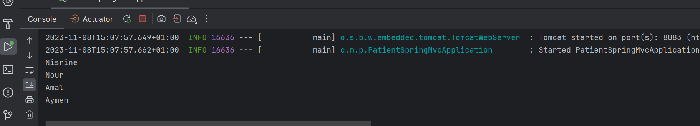
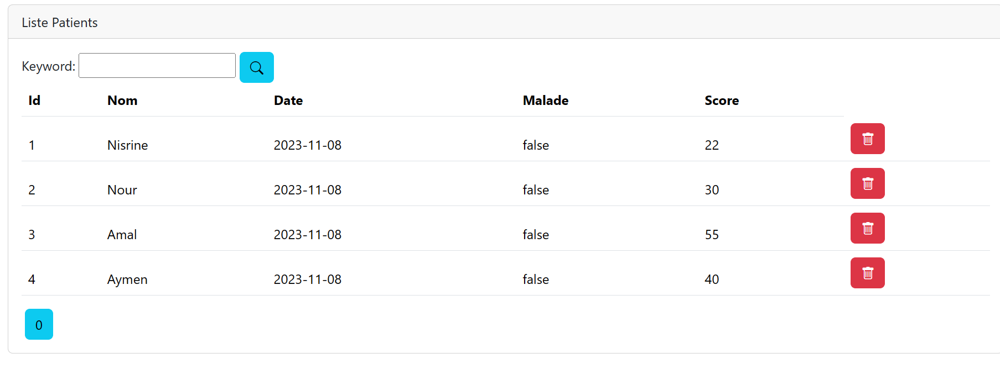
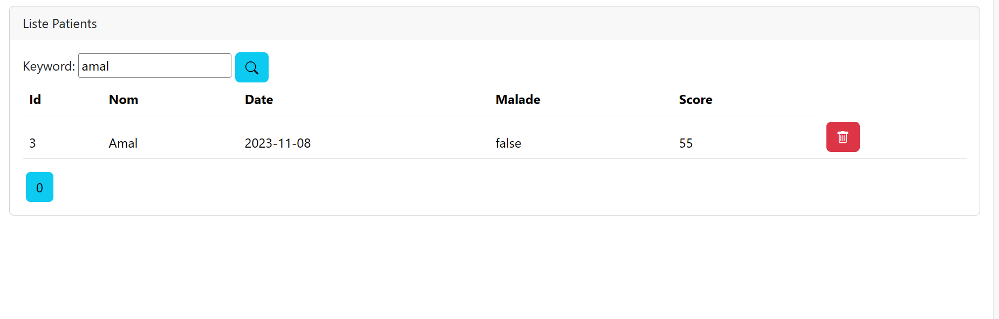
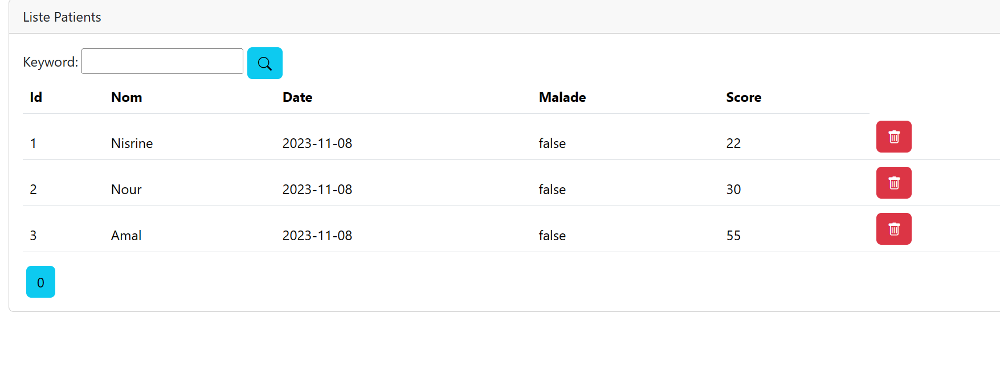
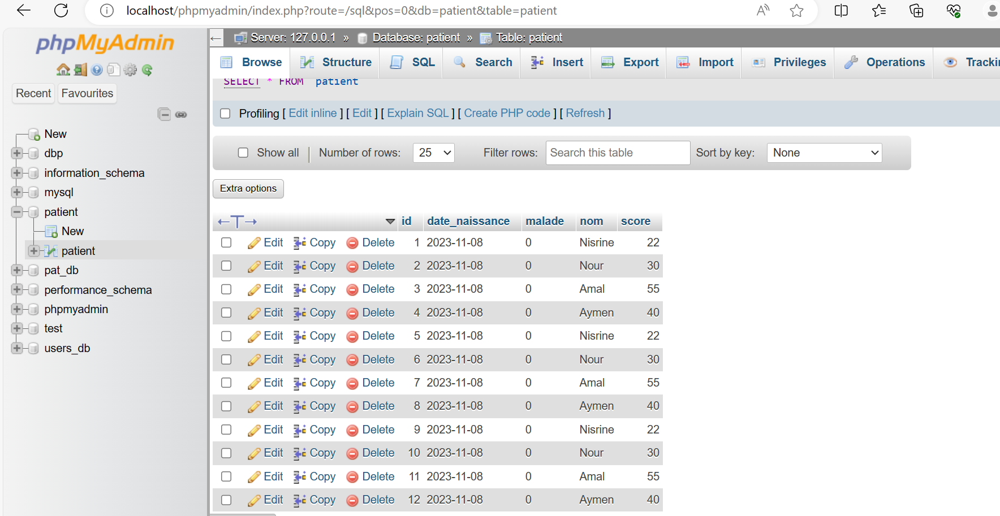
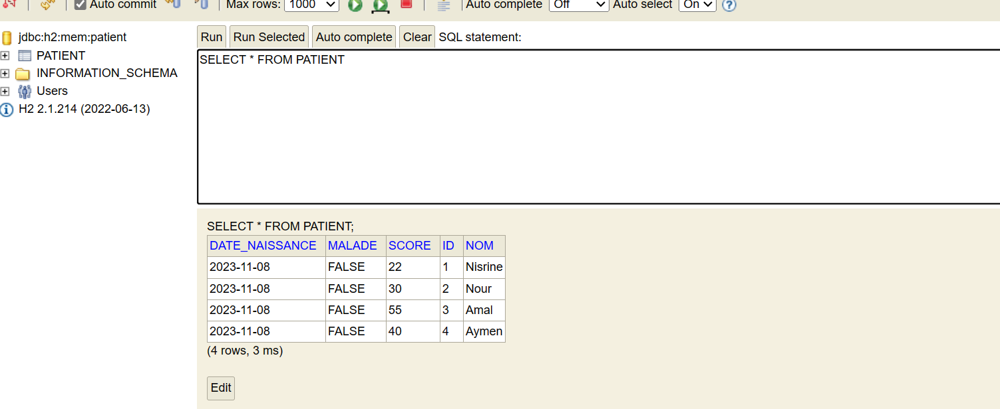
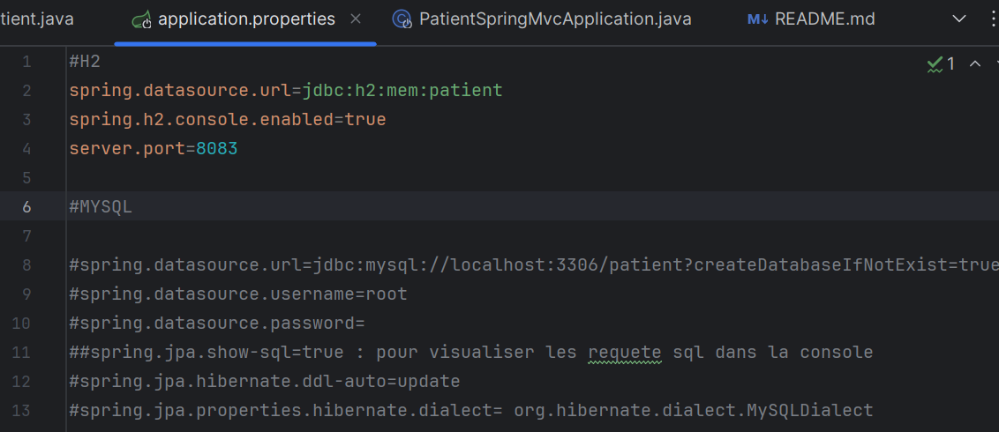

**README.md**

# Gestion des Patients

Ce projet est une application de gestion des patients développée avec le framework Spring MVC. L'application permet de récupérer un tableau de données à partir d'une base de données sous format tableau HTML, elle permet aussi la recherche des patients spécifiques et la suppression des enregistrements.

## Captures d'écran

### Fonctionnement du Programme

### Page Home

### Recherche de patients

### Suppression de patients

### Configuration de la base de données MySQL

### Configuration de la base de données H2

## Fonctionnalités

- Récupération des données à partir d'une base de données.
- Recherche de patients par différents critères.
- Suppression d'enregistrements de la base de données.
- Configuration flexible des bases de données MySQL et H2.

## Configuration de la Base de Données

L'application est configurée pour utiliser H2 par défaut. Si vous souhaitez utiliser MySQL, modifiez les propriétés de la base de données dans le fichier `application.properties` :

